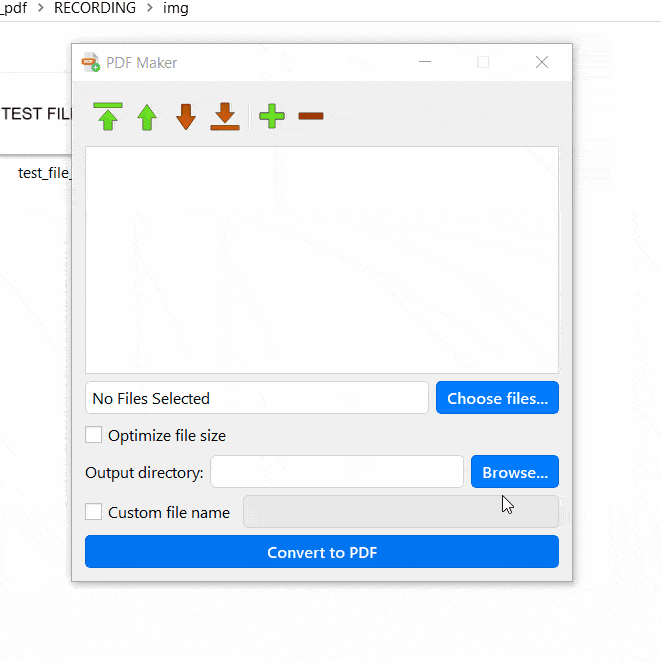

# pdf-maker
Simple program for converting images to PDF and merging PDF files into one. Built with PyQt5, Pillow and PyPDF2. Python 3.8.3.

## Features:
### Program can convert PNG, JPEG and TIFF files to PDF and join multiple PDF files into one document.

### Files can be added and deleted on the fly.

### User can set the order in which the files will be merged.

